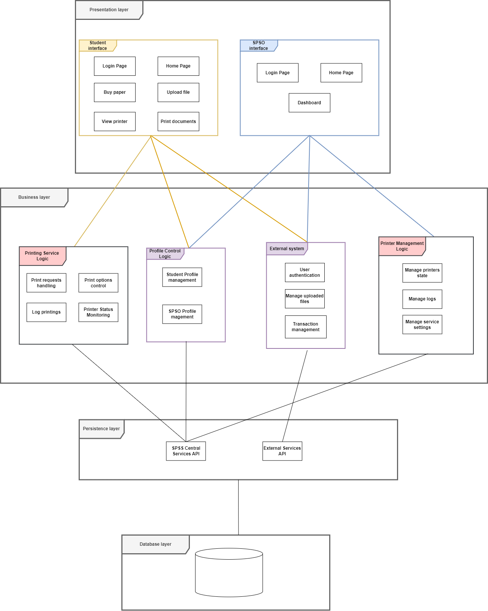

# Architecture Sesign

## Table of Contents
- [Architecture Sesign](#architecture-sesign)
  - [Table of Contents](#table-of-contents)
  - [Layered architecture](#layered-architecture)
    - [Presentation Strategy](#presentation-strategy)
    - [Data Storage Approach](#data-storage-approach)
    - [External services/API](#external-servicesapi)
    - [Components diagram](#components-diagram)

## Layered architecture

### Presentation Strategy
- The Presentation Layer is divided into two interfaces: Student Interface and SPSO Interface.
  - Both user types access the system through the pre-existing HCMUT Single Sign-On (SSO), ensuring secure authentication.
  
- Student Interface:
  - Upon logging in, students are directed to a personalized Home Page:
    - Displays current page balance.
    - Shows recent print activities.
    - Allows students to buy more paper.
  - Features:
    - **File Upload**: 
      - Push documents to the account’s document repository.
      - Detached from the Print Document feature to avoid redundant uploads.
    - **View Printer**: 
      - Provides information about printer locations and statuses on campus.
    - **Print Documents**: 
      - Allows students to select printers, ideally the nearest one.
      - Configure print options (e.g., paper size, single/double-sided, number of copies).
      - Monitor printing progress.

- SPSO Interface:
  - Upon logging in, SPSOs are directed to a Dashboard:
    - Provides an overview of system information:
      - Printer usage.
      - Monthly print job report of the SPSS.
    - Service Controls:
      - Add new printers from a list of unused printers.
      - Enable/Disable printers.
      - Define allowable file types for student uploads.
      - Manage various system configurations.

### Data Storage Approach

### External services/API

### Components diagram