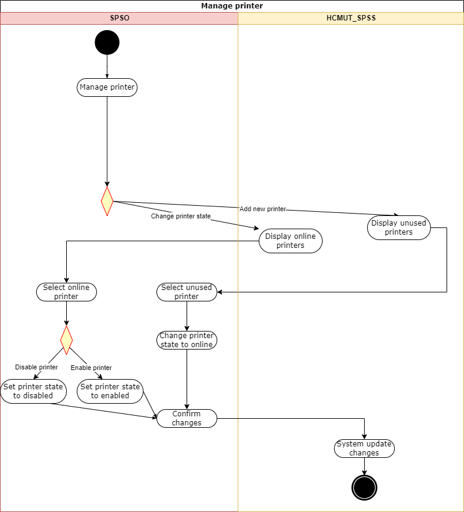
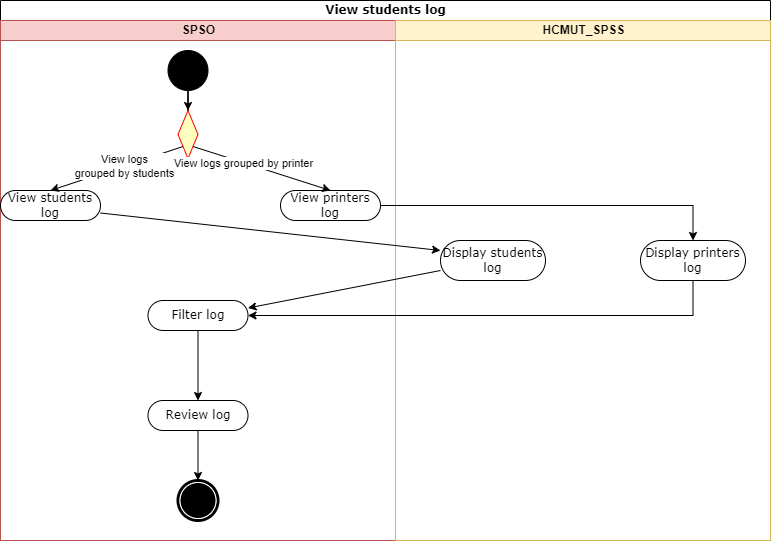
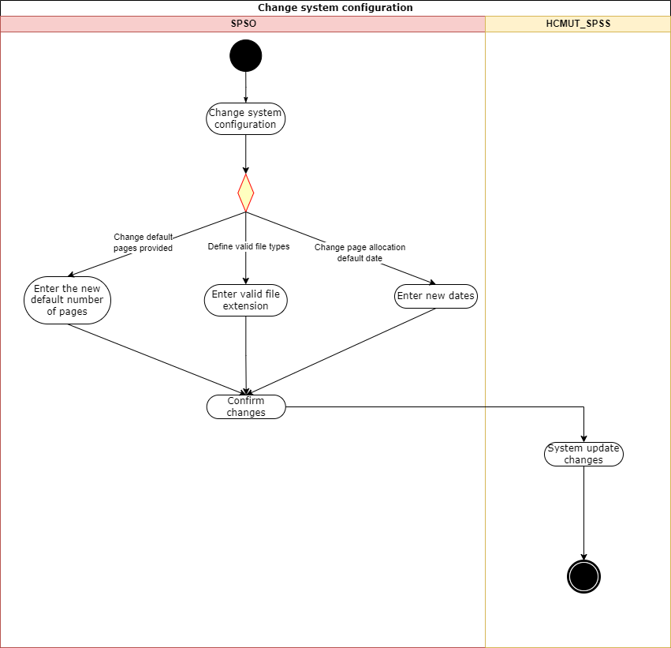
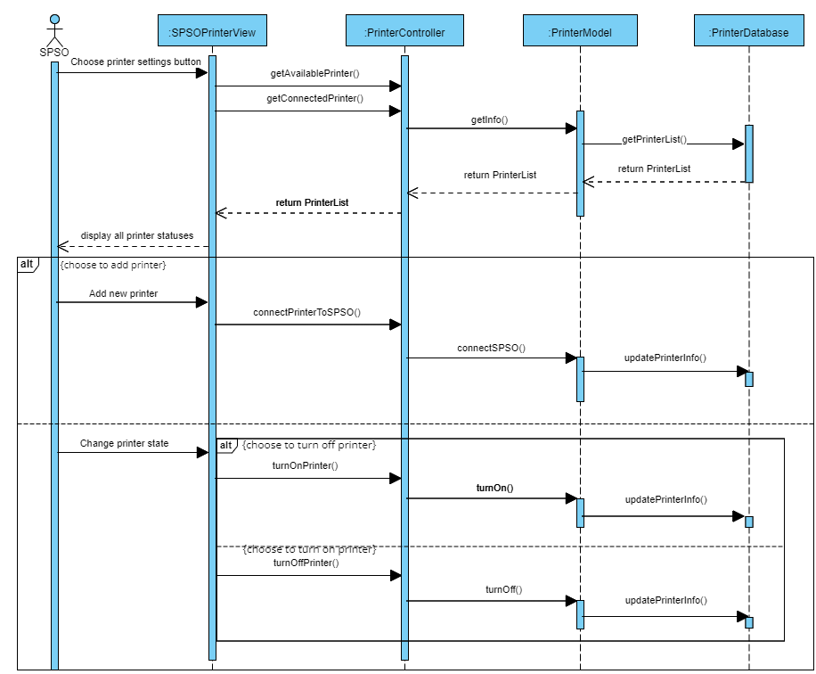
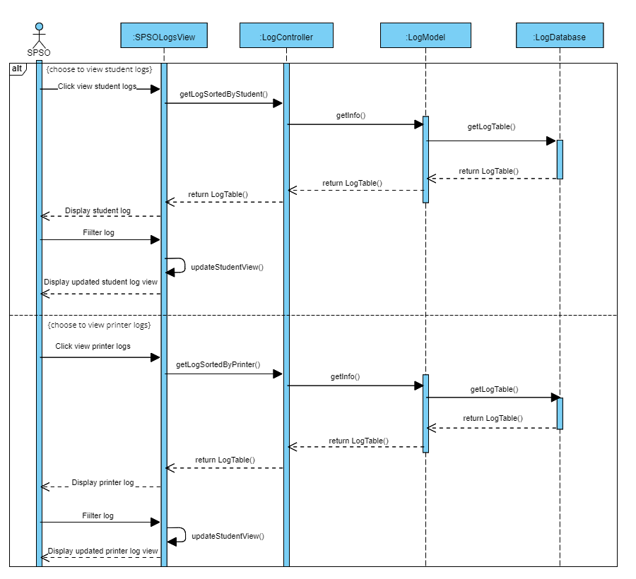
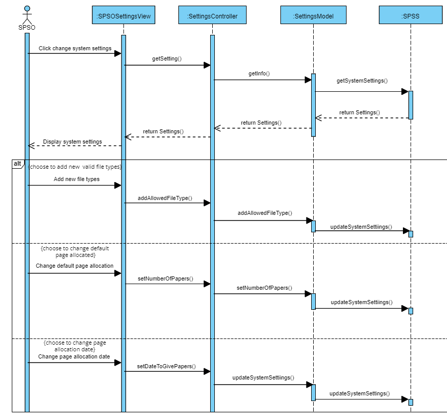
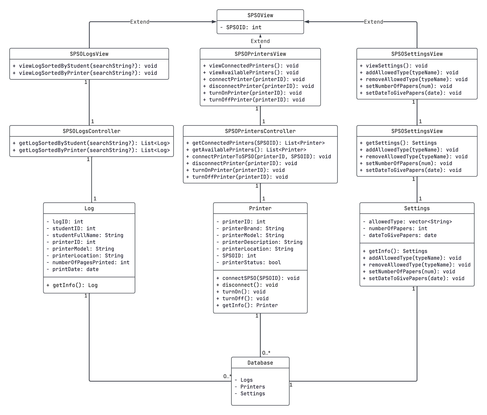

# System Modelling

## Table of Contents
- [System Modelling](#system-modelling)
  - [Table of Contents](#table-of-contents)
  - [Activity Diagrams](#activity-diagrams)
    - [Manage Printers](#manage-printers)
    - [View Student Logs](#view-student-logs)
    - [Change System Configurations](#change-system-configurations)
  - [Sequence diagram](#sequence-diagram)
    - [Manage Printers](#manage-printers-1)
    - [View Student Logs](#view-student-logs-1)
    - [Change System Configurations](#change-system-configurations-1)
  - [Class diagram](#class-diagram)
  - [User Interface](#user-interface)

## Activity Diagrams
### Manage Printers

### View Student Logs

### Change System Configurations

## Sequence diagram

### Manage Printers 

- The sequence diagram illustrates the process of managing printers within a system that involves SPSO and the Student Smart Printing Service (SSPS). This process including the following steps:
  - The SPSO first send a message to the SSPS to manage the printers
  - Then the SPSO will have 2 options to manage the printer: adding new printers or changing the printer status.
    - If the SPSO chooses to add a new printer, the SSPS will respond by displaying the unused printers. The SPSO can select the unused printer and change printer state to online.
    - If the SPSO chooses to change the printer state, the SSPS will display the online printers to the SPSO. To continue the process, the SPSO will then select the online printer, at this stage, the SPSO can have 2 options: set printer state to enable or disable.
  - The SSPS will then reply to the message by asking the SPSO to confirm the change. If the SPSO sends a message to confirm the change, the change will be updated and the SSPS will reply to SPSO by notifying the change is updated.

### View Student Logs

- The sequence diagram illustrates the process of viewing logs within a system that involves SPSO and the Student Smart Printing Service (SSPS), the process including the following steps:
  - The SPSO first sends a message to the SSPS to view the logs.
  -	The SPSO will have 2 options to view the logs: viewing the logs grouped by students or grouped by printers.
    - If the SPSO chooses to view the logs grouped by students, the SSPS will respond by displaying the students log.
    -	If the SPSO chooses to view the logs grouped by printers, the SSPS will respond by displaying the printers log.
  - The SPSO can then filter the log in the way they want to review. The SSPS will reply by sending the filtered log to the SPSO.

### Change System Configurations

- The sequence diagram illustrates the process of changing system configurations within a system that involves SPSO and the Student Smart Printing Service (SSPS). This process including the following steps:
  - The SPSO first sends a message to the SSPS to change the system configurations.
  -	Then the SPSO will have 3 options to manage the printer: changing the default pages provided to the students, defining the valid file types to print and changing the page allocation default date.
    -	If the SPSO chooses to change the default pages provided, the SPSO will enter the new default number of pages.
    - If the SPSO chooses to define valid file types, the SPSO will enter the valid file extension.
    - If the SPSO chooses to change page allocation default date, the SPSO will enter new dates.
  - The SSPS will then ask the SPSO to confirm the change.
  - If the SPSO confirms the change the SSPS will then reply by notifying the change is updated.

## Class diagram
### Design pattern used: MVC design pattern

1. **SPSOView (Base Class)**
    
    - **Attributes**:
        - `SPSOID: int`: Represents the unique identifier for an SPSO (Shared Printer System Operation).
    - **Purpose**: Acts as a base class for other views, providing common functionality for all SPSO-related views.
    - **Relationships**:
        - Extended by `SPSOLogsView`, `SPSOPrintersView`, and `SPSOSettingsView`.
2. **SPSOLogsView (Derived from SPSOView)**
    
    - **Methods**:
        - `viewLogSortedByStudent(searchString?): void`: Displays logs filtered or sorted by student name or ID.
        - `viewLogSortedByPrinter(searchString?): void`: Displays logs filtered or sorted by printer name or ID.
    - **Purpose**: Provides a user interface for viewing and filtering printer logs.
3. **SPSOPrintersView (Derived from SPSOView)**
    
    - **Methods**:
        - `viewConnectedPrinters(): void`: Displays printers currently connected to the SPSO.
        - `viewAvailablePrinters(): void`: Displays printers available for connection.
        - `connectPrinter(printerID): void`: Connects a specified printer to the SPSO.
        - `disconnectPrinter(printerID): void`: Disconnects a specified printer from the SPSO.
        - `turnOnPrinter(printerID): void`: Turns on a specified printer.
        - `turnOffPrinter(printerID): void`: Turns off a specified printer.
    - **Purpose**: Manages printers connected to the system and their statuses.
4. **SPSOSettingsView (Derived from SPSOView)**
    
    - **Methods**:
        - `viewSettings(): void`: Displays the current settings of the SPSO.
        - `addAllowedType(typeName): void`: Adds a new allowed document type for printing.
        - `removeAllowedType(typeName): void`: Removes a document type from the allowed list.
        - `setNumberOfPapers(num): void`: Sets the maximum number of papers allowed for a session.
        - `setDateToGivePapers(date): void`: Sets the date for giving papers to the printers.
    - **Purpose**: Provides configuration and management of SPSO settings.
5. **SPSOLogsController**
    
    - **Methods**:
        - `getLogSortedByStudent(searchString?): List<Log>`: Retrieves logs filtered or sorted by student name or ID.
        - `getLogSortedByPrinter(searchString?): List<Log>`: Retrieves logs filtered or sorted by printer name or ID.
    - **Purpose**: Acts as a controller to fetch log data for the view layer.
6. **SPSOPrintersController**
    
    - **Methods**:
        - `getConnectedPrinters(SPSOID): List<Printer>`: Gets a list of printers connected to a specific SPSO.
        - `getAvailablePrinters(): List<Printer>`: Gets a list of printers available for connection.
        - `connectPrinterToSPSO(printerID, SPSOID): void`: Connects a printer to a specified SPSO.
        - `disconnectPrinter(printerID): void`: Disconnects a printer.
        - `turnOnPrinter(printerID): void`: Turns on a printer.
        - `turnOffPrinter(printerID): void`: Turns off a printer.
    - **Purpose**: Handles printer-related operations between the database and views.
7. **Settings**
    
    - **Attributes**:
        - `allowedType: vector<String>`: A list of allowed document types for printing.
        - `numberOfPapers: int`: Maximum number of papers allowed for a session.
        - `dateToGivePapers: date`: Date when papers are supplied.
    - **Methods**:
        - `getInfo(): Settings`: Retrieves current settings.
        - `addAllowedType(typeName): void`: Adds a document type to the allowed list.
        - `removeAllowedType(typeName): void`: Removes a document type from the allowed list.
        - `setNumberOfPapers(num): void`: Sets the number of allowed papers.
        - `setDateToGivePapers(date): void`: Updates the date for giving papers.
    - **Purpose**: Stores and manages configuration data for the SPSO.
8. **Printer**
    
    - **Attributes**:
        - `printerID: int`: Unique ID of the printer.
        - `printerBrand: String`: Brand of the printer.
        - `printerModel: String`: Model of the printer.
        - `printerDescription: String`: Description of the printer.
        - `printerLocation: String`: Physical location of the printer.
        - `SPSOID: int`: ID of the SPSO to which the printer is connected.
        - `printerStatus: bool`: Indicates whether the printer is on (true) or off (false).
    - **Methods**:
        - `connectSPSO(SPSOID): void`: Connects the printer to a specified SPSO.
        - `disconnect(): void`: Disconnects the printer.
        - `turnOn(): void`: Turns the printer on.
        - `turnOff(): void`: Turns the printer off.
        - `getInfo(): Printer`: Retrieves printer information.
    - **Purpose**: Represents a physical printer and its operations.
9. **Log**
    
    - **Attributes**:
        - `logID: int`: Unique identifier for the log entry.
        - `studentID: int`: ID of the student associated with the log entry.
        - `studentFullName: String`: Full name of the student.
        - `printerID: int`: ID of the printer used.
        - `printerModel: String`: Model of the printer used.
        - `printerLocation: String`: Location of the printer used.
        - `numberOfPagesPrinted: int`: Number of pages printed.
        - `printDate: date`: Date of the print job.
    - **Methods**:
        - `getInfo(): Log`: Retrieves log information.
    - **Purpose**: Represents a log entry for printing activities.
10. **Database**
    
    - **Attributes**:
        - Contains collections for `Logs`, `Printers`, and `Settings`.
    - **Purpose**: Acts as the data storage for the entire system.
    - **Relationships**:
        - Associates `Log`, `Printer`, and `Settings`.

## User Interface
**[Figma design for the complete UI](https://www.figma.com/design/6NVehmXsGFwxde0R8Yqu7m/CC01_group_6_wireframe?node-id=0-1&node-type=canvas&t=eKPUv3VF8FcQxwWT-0)**
